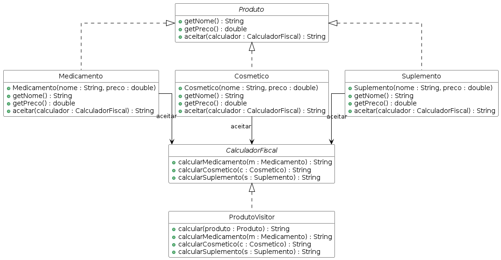

# Cálculo de Impostos em Produtos de Farmácia

Sistema que calcula o imposto de produtos farmacêuticos de acordo com sua categoria, sem alterar as classes dos produtos.

## Domínio

Uma farmácia vende três tipos de produto: Medicamento (isento de imposto), Cosmético (25% de imposto) e Suplemento (12% de imposto). O cálculo precisa ser feito por fora, sem modificar cada produto.

## Padrão aplicado

**Visitor** — a interface `CalculadorFiscal` define uma operação para cada tipo de produto. A classe `ProdutoVisitor` implementa o cálculo específico por categoria. Cada produto aceita o visitante e delega a chamada correta (`calcularMedicamento`, `calcularCosmetico`, `calcularSuplemento`), permitindo adicionar novos cálculos sem tocar nos produtos.

## Diagrama de classes

